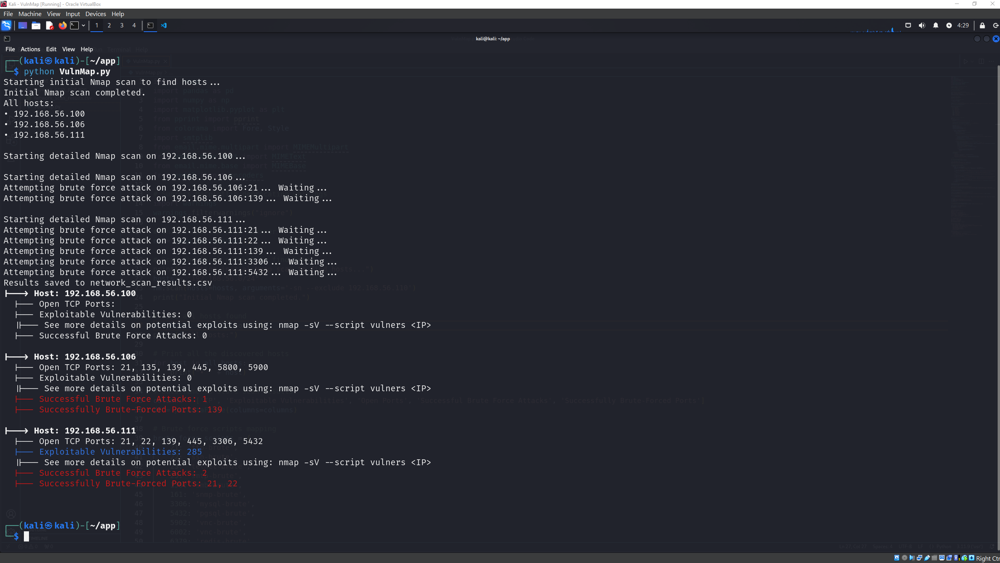
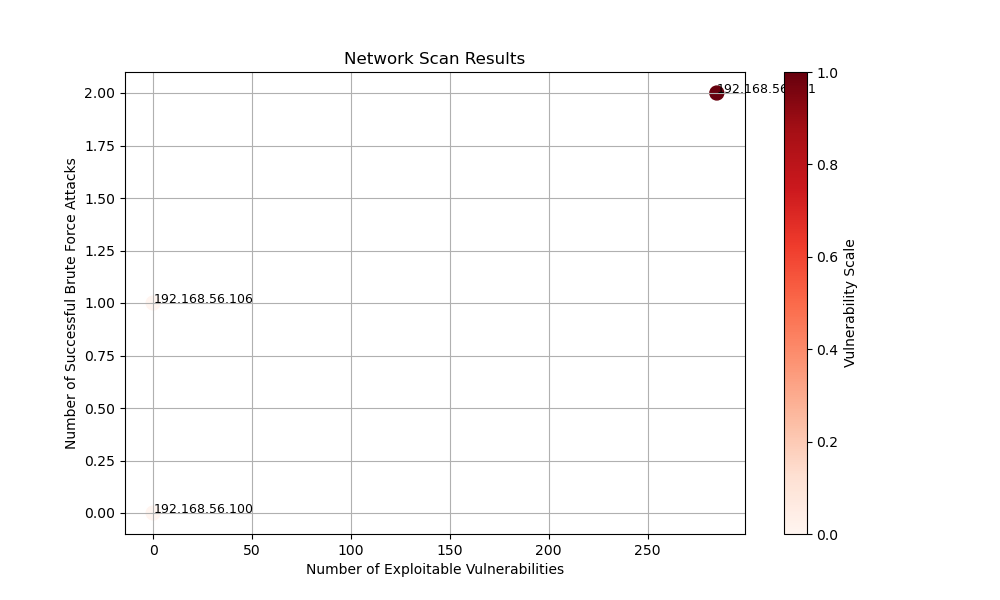

# Network Vulnerability Scanner & Brute Force Analyzer

## Overview

This project is a Python-based network scanning and analysis tool built on top of **Nmap**.  
It performs host discovery, service enumeration, vulnerability detection, optional brute-force testing on common services, and visualizes the results in both tabular and graphical formats.

⚠️ **This tool is intended for educational purposes and authorized security testing only.**  
Running it against systems you do not own or explicitly have permission to test is illegal.

## Features

- Network host discovery using Nmap ping scans
- Service and version detection
- Vulnerability enumeration via the `vulners` Nmap script
- Brute-force testing on selected services (FTP, SSH, Telnet, SMTP, SMB, etc.)
- Results aggregation into a CSV file
- Tree-style console output for readability
- Scatter plot visualization of vulnerabilities vs. brute-force success
- Optional email reporting (commented out by default)

## Network Scope

By default, the script scans:

    192.168.56.0/24

With the following exclusion:

    192.168.56.110

You can modify this directly in the script:

    hosts = "192.168.56.0/24"
    nm.scan(hosts=hosts, arguments='-sn --exclude 192.168.56.110')

## Brute Force Capabilities

The script attempts brute-force attacks only on predefined ports using Nmap NSE scripts:

| Port | Service        | Script Used   |
|------|----------------|---------------|
| 21   | FTP            | ftp-brute     |
| 22   | SSH            | ssh-brute     |
| 23   | Telnet         | telnet-brute  |
| 25   | SMTP           | smtp-brute    |
| 139  | SMB            | smb-brute     |
| 161  | SNMP           | snmp-brute    |
| 3306 | MySQL          | mysql-brute   |
| 5432 | PostgreSQL     | pgsql-brute   |
| 5902 | VNC            | vnc-brute     |
| 6002 | VNC            | vnc-brute     |
| 6379 | Redis          | redis-brute   |

Credentials are loaded from a file named:

    credentials.txt

You must create and populate this file manually.

## Requirements

### System Requirements

- Linux (recommended)
- Network access to the target subnet

Install Nmap:

    sudo apt install nmap

### Python Dependencies

Install required Python libraries:

    pip install python-nmap pandas numpy matplotlib colorama

## How It Works

1. Host Discovery  
   Uses `nmap -sn` to find live hosts on the network

2. Detailed Scanning  
   Runs `-sV --script vulners` on each discovered host

3. Data Extraction  
   Collects:
   - Open ports
   - Number of exploitable vulnerabilities
   - Successful brute-force attempts

4. Reporting  
   Outputs results to:
   - Console (tree format)
   - network_scan_results.csv
   - network_scan_plot.png

## Output Files

### CSV Report

    network_scan_results.csv

Contains:
- IP address
- Open ports
- Number of exploitable vulnerabilities
- Successful brute-force attempts
- Successfully brute-forced ports

## Example Console Output

### Visualization

    network_scan_plot.png

Scatter plot:
- X-axis: Exploitable vulnerabilities
- Y-axis: Successful brute-force attacks
- Color scale: Overall risk level

## Email Reporting (Optional)

The script includes commented-out email functionality using SMTP.

To enable it:
1. Configure SMTP credentials
2. Uncomment the email section
3. The script will send:
   - Tree-formatted report
   - Attached network visualization image

## Security & Legal Disclaimer

WARNING

This tool performs:
- Network scanning
- Service enumeration
- Brute-force authentication attempts

Only use it on:
- Systems you own
- Systems you have explicit written permission to test

The author is not responsible for misuse or damage caused by this script.

## Future Improvements

- Support multiple credential files
- Export to HTML or PDF reports
- Risk scoring per host

## License

DHushCP is licensed under the **GNU GENERAL PUBLIC LICENSE Version 3**.